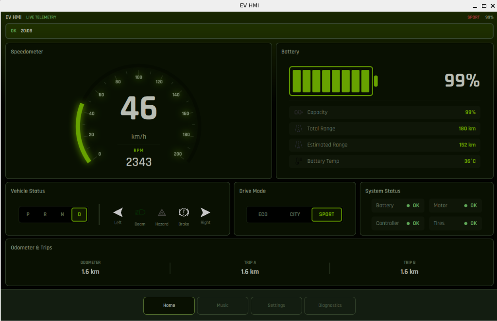
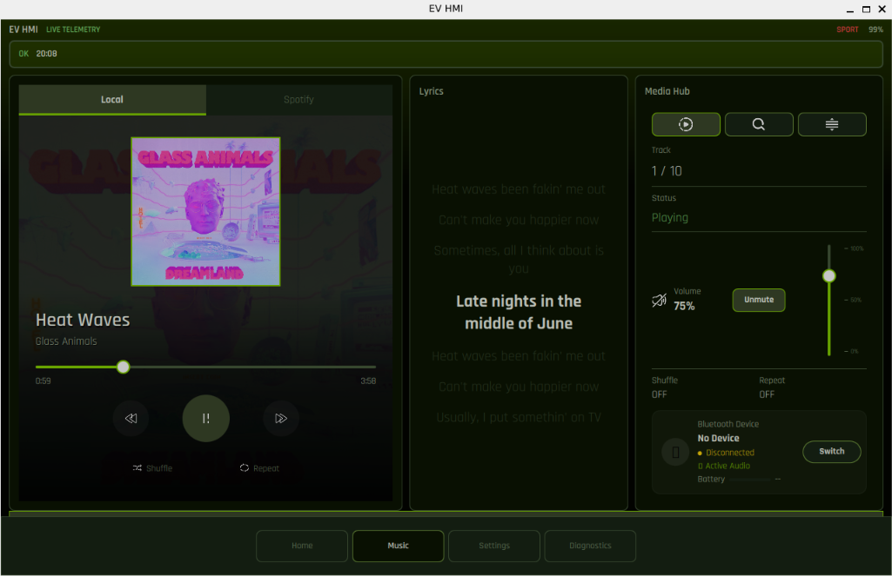
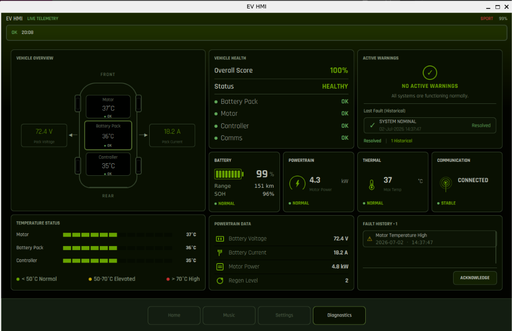
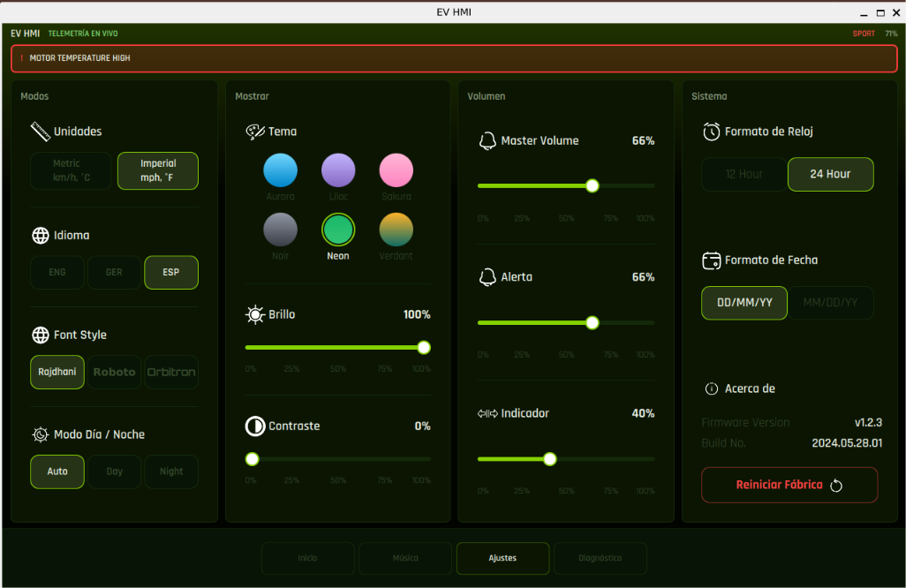

<p align="center">
  
</p>

<h1 align="center">EV_HMI</h1>

<p align="center">
A modern Electric Vehicle Human Machine Interface built using <strong>Qt 6</strong>, <strong>QML</strong>, and <strong>C++</strong>.
</p>

<p align="center">


</p>

---

## Overview

EV_HMI is a modern automotive Human Machine Interface (HMI) designed for embedded Linux platforms. Developed using **Qt 6**, **Qt Quick**, and **C++**, the project recreates the experience of a production-grade digital cockpit by combining real-time vehicle telemetry, multimedia playback, diagnostics, and embedded communication into a single responsive interface.

The application follows a modular architecture with a clear separation between the C++ backend and the QML frontend, making it scalable, maintainable, and suitable for deployment on Raspberry Pi-based automotive systems.

---

# Screenshots

## Digital Cockpit

<p align="center">

</p>

The primary dashboard displays the most important driving information including vehicle speed, battery state of charge, remaining range, drive mode, gear indication, charging status, warning indicators, and vehicle telemetry. The interface is designed to maximize readability while minimizing driver distraction.

---

## Infotainment

<p align="center">

</p>

The infotainment system provides a modern multimedia experience with support for local music playback, Spotify integration, Bluetooth audio, album artwork, playlists, playback controls, and seamless switching between media sources.

---

## Diagnostics & Engineering Mode

<p align="center">

</p>

A long press on the Diagnostics page unlocks Engineering Mode, providing access to live telemetry, thermal monitoring, powertrain analysis, communication diagnostics, simulator controls, telemetry logging, and fault monitoring for development and testing.

---

## Personalisation

<p align="center">

</p>

The dashboard supports six custom dashboard themes, each available in Light and Dark modes. Users can further personalize the interface through brightness and contrast adjustment, language selection, Spotify or local music configuration, and factory reset options.

---

# Features

### Digital Instrument Cluster

- Real-time Speedometer
- Battery State of Charge (SOC)
- Remaining Range Estimation
- Motor RPM Monitoring
- Drive Modes
- Gear Indicator
- Turn Indicators
- Charging Status
- Vehicle Warning System

### Infotainment

- Local Music Playback
- Spotify Integration
- Bluetooth Audio
- Album Artwork
- Playlist Navigation
- Playback Controls
- Volume Control

### Diagnostics

- Live Vehicle Telemetry
- Battery Diagnostics
- Thermal Monitoring
- Powertrain Monitoring
- Communication Diagnostics
- Fault Monitoring
- Telemetry Log Export

### Simulation

- Virtual Vehicle Simulator
- Driver Input Simulator
- STM32 Data Simulator
- Communication Fault Simulation
- Real-Time Telemetry Logging

### Embedded Features

- Raspberry Pi Deployment
- Automatic Startup
- Theme Engine
- Light & Dark Mode
- Multi-language Support
- Factory Reset
- Brightness & Contrast Adjustment

---

# Technology Stack

### Backend

- C++17
- Qt 6
- Qt Multimedia
- Qt Network
- Qt NetworkAuth
- Qt SerialPort

### Frontend

- Qt Quick
- QML
- JavaScript

### Build System

- CMake

### Target Platforms

- Ubuntu 24.04+
- Raspberry Pi OS (Bookworm)
- WSL2 (with WSLg)

---

# Project Structure

```text
EV_HMI/
│
├── assets/              # Icons, images, audio and documentation assets
├── backend/             # C++ backend implementation
├── config/              # Application configuration
├── docs/                # Technical documentation
├── qml/                 # Qt Quick user interface
│   ├── components/
│   ├── pages/
│   ├── themes/
│   └── Main.qml
│
├── scripts/             # Deployment utilities
├── CMakeLists.txt
├── LICENSE
└── main.cpp
```

---

# Architecture

The project follows a layered architecture.

```text
                   +-------------------------+
                   |       QML UI            |
                   | Pages • Components      |
                   +------------▲------------+
                                │
                   Context Properties
                                │
+------------------------------------------------------------+
|                 Backend (Qt / C++)                         |
|                                                            |
| VehicleData      LocalMusicPlayer      SpotifyAPIManager   |
| SerialManager    WarningManager        BluetoothManager    |
| VirtualVehicle   DriverInput           TelemetryLogger     |
+----------------------------▲-------------------------------+
                             │
                    STM32 / Simulators
```

The backend exposes data to QML through context properties, ensuring a clean separation between presentation and application logic.

---

# Deployment

The project includes a unified deployment script for dependency installation, building, and Raspberry Pi deployment.

## First-Time Setup

```bash
chmod +x scripts/deploy.sh
./scripts/deploy.sh --install
```

---

## Daily Development

```bash
./scripts/deploy.sh
```

---

## Clean Rebuild

```bash
./scripts/deploy.sh --clean
```

---

## Build Only

```bash
./scripts/deploy.sh --no-run
```

---

## Enable Automatic Startup

```bash
./scripts/deploy.sh --autostart
```

Run once to configure automatic startup on Raspberry Pi boot.

---

## Complete Raspberry Pi Deployment

```bash
./scripts/deploy.sh --install --clean --autostart
```

---

# Deployment Script

| Command | Description |
|----------|-------------|
| `./scripts/deploy.sh` | Build and launch the application |
| `./scripts/deploy.sh --install` | Install required dependencies |
| `./scripts/deploy.sh --clean` | Remove previous build before compiling |
| `./scripts/deploy.sh --no-run` | Build without launching |
| `./scripts/deploy.sh --autostart` | Configure automatic startup |
| `./scripts/deploy.sh --help` | Display deployment help |

---

# Documentation

Additional documentation is available in the **docs/** directory.

| Document | Description |
|----------|-------------|
| Architecture | Software architecture overview |
| Communication Protocol | STM32 communication protocol |
| Telemetry API | Vehicle telemetry interface |
| Media API | Multimedia interface |
| Spotify Integration | Spotify authentication and playback |

---

# License

This project is licensed under the **MIT License**.

See the [LICENSE](LICENSE) file for details.

---

# Author

**Aditya Pant and Rohan Bhide**

Developed as part of the **KPIT Apex Lab EV Telemetry Analysis using HMI Project** using **Qt 6**, **QML**, and **C++**.